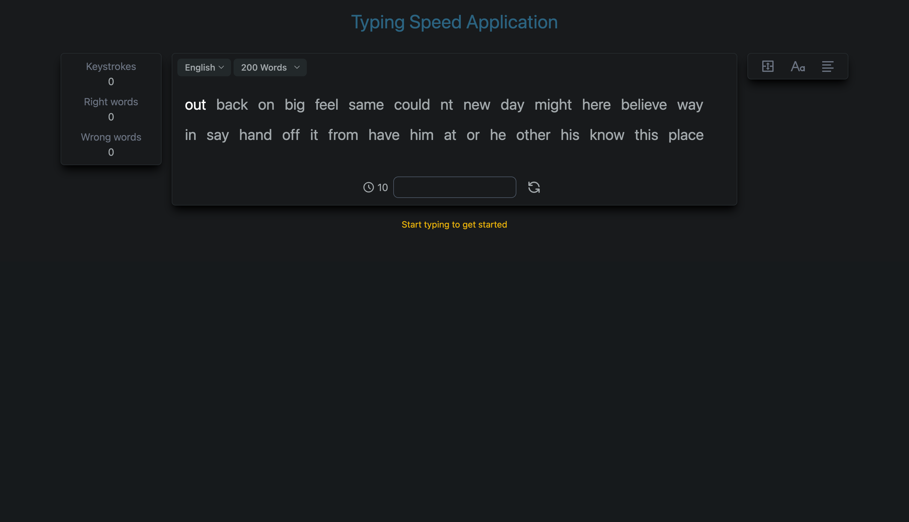
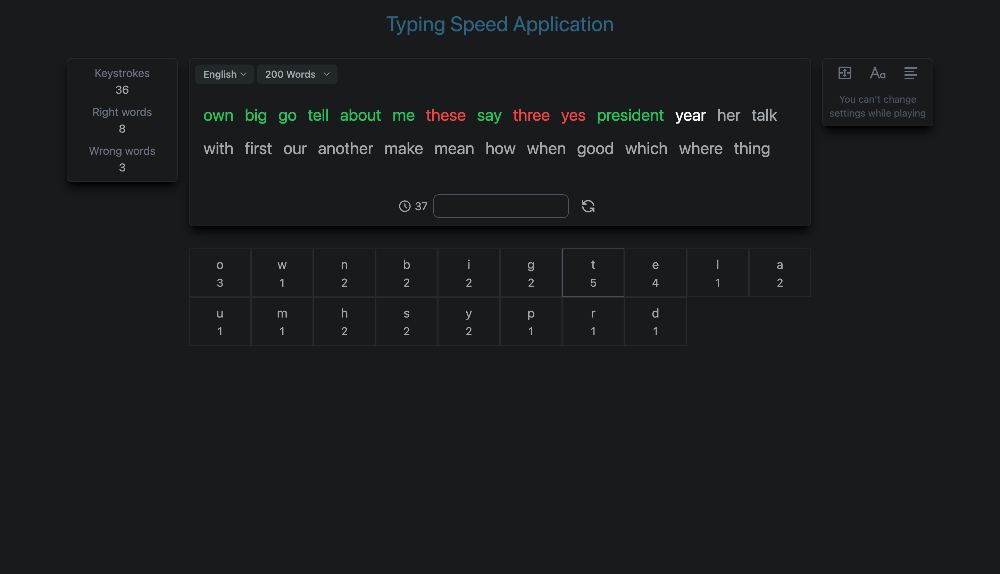
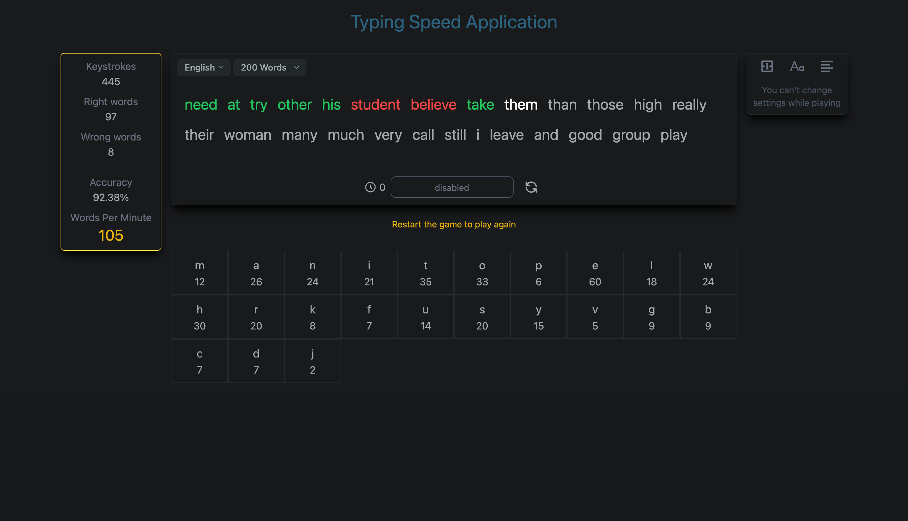

<div>
  <p align="center">
    <i>Typing Speed App</i>
  </p>
  <div align="center">
    
    
    
  </div>
</div>

# Notice

This is not a completed game. I have not integrated some of the game rules and it is not fully optimized. It's a game I scribble while I'm resting.

## Features

- Language change
- Word count
- Board size & Text size & Text alignment settings
- Statistics
- Save game adjustments to JSON locally

## Development Setup

```console
  git clone https://github.com/sevilgurkan/typing-speed-app.git
```
